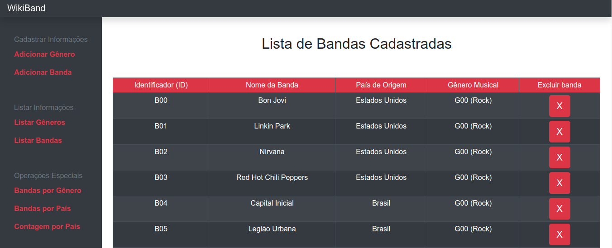

<h1 align="center">
    
</h1>

  <a href="#-projeto">Projeto</a>
  &nbsp;&nbsp;&nbsp;|&nbsp;&nbsp;&nbsp;
  <a href="#-tecnologias">Tecnologias</a>
  &nbsp;&nbsp;&nbsp;|&nbsp;&nbsp;&nbsp;
  <a href="#-operações-implementadas">Operações implementadas</a>

    
    
    

## ✦ Projeto

O projeto consiste de um sistema de arquitetura MVC, com o intuito de possibilitar a construção de um catálogo de gêneros e bandas musicais. A aplicação construída também possibilita a análise de alguns dados interessantes através do cruzamento de informações acerca dos dados cadastrados.

## ✦ Tecnologias
Esse projeto foi desenvolvido com as seguintes tecnologias:
- [Flask](https://flask.palletsprojects.com/en/1.1.x/)
- [Bootstrap](https://getbootstrap.com/)

## ✦ Operações implementadas

Segue abaixo uma lista de todas as operaçoes suportadas pela aplicação:

**Cadastro:**
- Gênero musical
- Banda musical

**Listagem:**
- Gêneros cadastrados
- Bandas cadastradas

**Informações:**
- Lista de bandas filtradas por gênero musical
- Lista de bandas filtradas por páis de origem
- Lista com o número de bandas por país cadastrado

---

O projeto foi desenvolvido para fins didáticos e aprendizado pessoal

